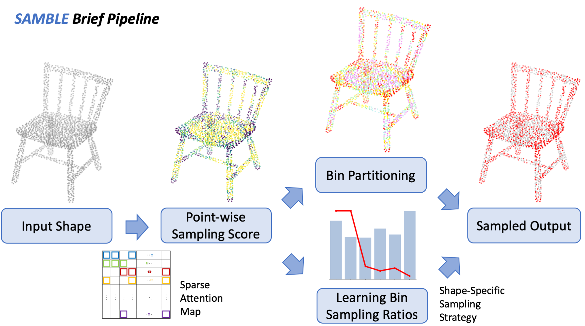

Hi there! I am a Ph.D. at the Vision and Fusion Laboratory (IES) at Karlsruher Institut of Technologie (KIT), under the supervision of [Prof. Jürgen Beyerer](https://ies.iar.kit.edu/1473_1497.php). Before that, I was a research scientist at the Institute for Visualization and Data Analysis (IVD) at KIT. I received my master’s degree in Control Science and Engineering and my bachelor’s degree in Automation from Nanjing University (NJU). 

My primary research focus is 3D computer vision, encompassing various areas. In applied research, I am deeply involved in the [AgiProbot project](https://www.wbk.kit.edu/wbkintern/Forschung/Projekte/AgiProbot/) (feel free to take the [virtual tour](https://www.wbk.kit.edu/wbkintern/Forschung/Projekte/AgiProbot/Tour/index.htm) !), where I handle tasks like point cloud segmentation, synthetic data generation, and sim2real transfer learning. In terms of theoretical research, I am engaged in developing new algorithms for self-supervised learning, 3D shape generation, and point cloud analysis (feel free to check my [CVPR 2023 highlight paper](https://arxiv.org/abs/2302.14673) and the recently accepted [CVPR 2025 paper](https://arxiv.org/abs/2504.19581) ). I am also very interested in multi-modal learning, scene-level 2D image analysis (e.g. panoramic images), and vision-language models (e.g. video narration).

I am trying a new template, so this webpage is still under construction. Stay tuned! :) 

<section id="news">
  <h2 style="font-size: 1.5em; margin-bottom: 0.5em;">🔥 News</h2>
  

    <ul style="list-style: none; padding-left: 0; font-size: 0.85em; line-height: 1.6;">
      <li><b>[Feb 2025]</b>: A paper <a href="https://stevenczwu.github.io/publication/2025-06-11-SAMBLE">SAMBLE</a> has been accepted at CVPR 2025.</li>
      <li><b>[Dec 2024]</b>: A paper <a href="https://stevenczwu.github.io/publication/2024-12-01-RethinkPoAtt">Rethinking Attention Module Design for Point Cloud Analysis</a> has been accepted at ICPR 2024.</li>
      <li><b>[Jul 2024]</b>: A paper <a href="https://stevenczwu.github.io/publication/2024-10-04-OPS">OPS</a> has been accepted at ECCV 2024.</li>
      <li><b>[Jul 2024]</b>: A paper <a href="https://stevenczwu.github.io/publication/2024-10-01-HybridFormer">HybridFormer</a> has been accepted at ECCV Workshop 2024.</li>
      <li><b>[Mar 2024]</b>: A paper <a href="https://stevenczwu.github.io/publication/2024-06-19-BoltPosePK">6D Pose Estimation on Point Cloud Data through Prior Knowledge Integration</a> has been accepted at CIRP LCE 2024.</li>
      <li><b>[Dec 2023]</b>: A paper <a href="https://stevenczwu.github.io/publication/2024-03-18-PoCCA">PoCCA</a> has been accepted at 3DV 2024.</li>
      <li><b>[Nov 2023]</b>: A paper <a href="https://stevenczwu.github.io/publication/2023-12-05-SwitchVAE">SwitchVAE</a> has been accepted by IEEE TMM.</li>
      <li><b>[Mar 2023]</b>: A paper <a href="https://stevenczwu.github.io/publication/2023-06-20-APES">APES</a> has been selected as Highlight at CVPR 2023.</li>
      <li><b>[Feb 2023]</b>: A paper <a href="https://stevenczwu.github.io/publication/2023-06-20-APES">APES</a> has been accepted at CVPR 2023.</li>
      <li><b>[Feb 2023]</b>: A paper <a href="https://stevenczwu.github.io/publication/2023-06-18-VoxAttention">VoxAttention</a> has been accepted at CVPR Workshop 2023.</li>
      <li><b>[Jan 2023]</b>: A paper <a href="https://stevenczwu.github.io/publication/2023-02-19-AgiBenchmark">SynMotor: A Benchmark Suite</a> has been selected as the Best Paper Finalist at VISAPP 2023.</li>
      <li><b>[Dec 2022]</b>: A paper <a href="https://stevenczwu.github.io/publication/2023-02-19-AgiBenchmark">SynMotor: A Benchmark Suite</a> has been accepted at VISAPP 2023.</li>
      <li><b>[Oct 2022]</b>: A paper <a href="https://stevenczwu.github.io/publication/2023-01-03-AgiPointSeg">Sim2real Transfer Learning for Point Cloud Segmentation</a> has been accepted at WACV 2023.</li>
      <li><b>[Jan 2022]</b>: A paper <a href="https://stevenczwu.github.io/publication/2022-04-06-MotorBlenderAddon">MotorFactory: A Blender Add-on</a> has been accepted at CIRP CATS 2022.</li>
      <li><b>[May 2020]</b>: A paper <a href="https://stevenczwu.github.io/publication/2020-08-26-PointEmbedding">Local Correlation-Aware Point Embedding</a> has been selected as the Best Paper Finalist at IVPR 2020.</li>
      <li><b>[May 2020]</b>: A paper <a href="https://stevenczwu.github.io/publication/2020-08-26-PointEmbedding">Local Correlation-Aware Point Embedding</a> has been accepted at IVPR 2020.</li>
    </ul>
  

</section>

<section id="selected_publications">
    
 
      📖 <b>Selected Publications</b>   
    

    

      

        
      

      

        <ul style="margin: 0; padding-left: 20px; list-style-type: disc; font-size: 14px;">
          <li>SAMBLE: Shape-Specific Point Cloud Sampling for an Optimal Trade-Off Between Local Detail and Global Uniformity</li>
          <li><b>C. Wu</b>, Y. Wan, H. Fu, J. Pfrommer, Z. Zhong, J. Zheng, J. Zhang, and J. Beyerer</li>
          <li>CVPR 2025</li>
          <li><a href="https://arxiv.org/pdf/2504.19581">📄 Paper</a> | <a href="https://github.com/stevenczwu/SAMBLE">💻 Code</a> | <a href="https://junweizheng93.github.io/publications/Samble/Samble.html">🏡 Homepage</a> | <a href="https://www.youtube.com/watch?v=FZtNayVyaRE">🎥 Video</a></li>
        </ul>
      

    

</section>

