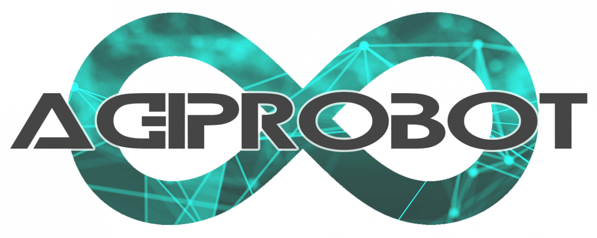
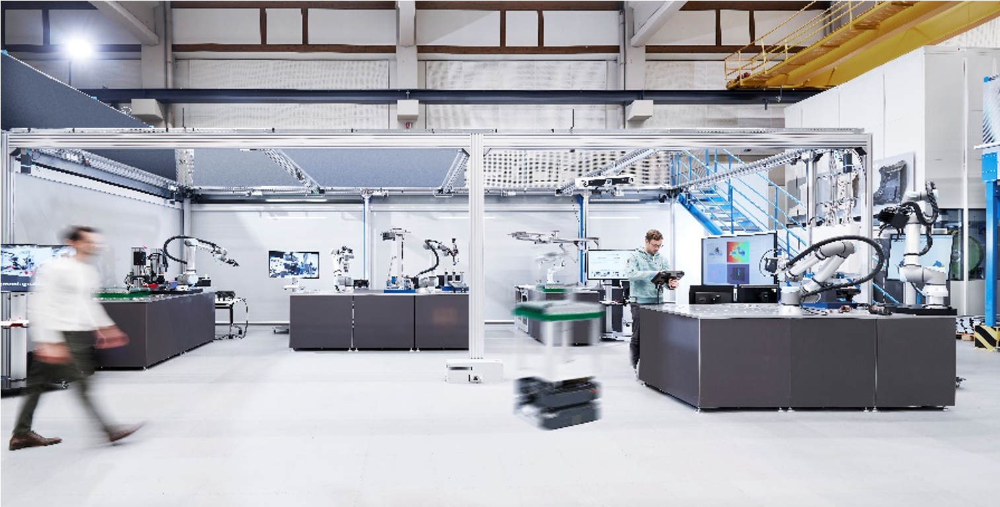

  
  
  

  
  

<b>Project Description:</b>
Agile production system using mobile, learning robots with multisensor technology under uncertain product specifications.

<b>Goal:</b>
How can a factory autonomously adapt to constantly changing conditions? The research project "AgiProbot" at the Karlsruhe Institute of Technology (KIT) addresses exactly this question. Remanufacturing serves as an ideal application scenario: used products return to the factory in an unknown condition, at unknown times, and in unknown quantities, and should be dismantled as automatically as possible with selected components reintegrated into production processes. The project aims to design an agile production system that uses artificial intelligence to dynamically respond to uncertain product specifications. This question is addressed by an interdisciplinary research group comprising several institutes from mechanical engineering, electrical engineering and information technology, as well as computer science, in order to specifically combine complementary expertise.

<a href="https://www.wbk.kit.edu/wbkintern/Forschung/Projekte/AgiProbot/index.php">🏡 Project Homepage</a> | <a href="https://www.wbk.kit.edu/wbkintern/Forschung/Projekte/AgiProbot/Tour/index.htm">🎡 Virtual Online Tour</a>

