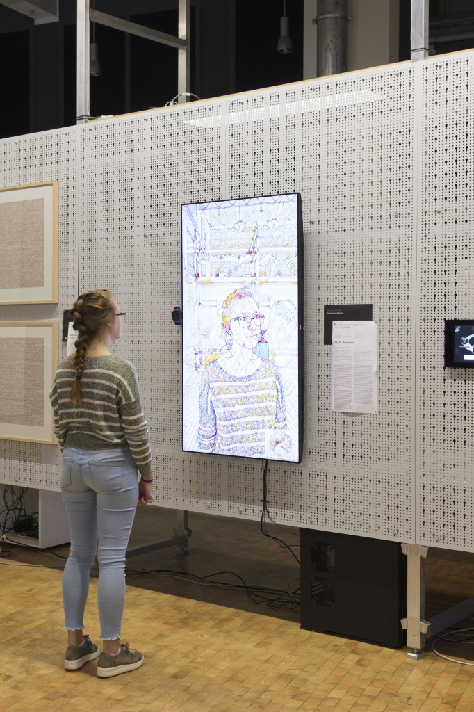

  

  
  

<b>Project Description:</b>
An interactive installation that uses neural networks for real-time AI-driven style transfer.

<b>Details:</b>
That artificial neural networks can be used to create non-photorealistic as well as photorealistic images was demonstrated for the first time by Gatys, Ecker, and Bethge of the University of Tübingen in 2015 with their article »A Neural Algorithm of Artistic Style« (Leon A. Gatys, Alexander S. Ecker, Matthias Bethge, Bethge Lab, University of Tübingen, arXiv, 2015). The network combines the characteristics of a particular artistic style with the content of an arbitrary image. Back in 2015, however, it took several minutes to render photographs in the style of contemporary painters. This has now been reduced dramatically at KIT by utilizing a neural network pre-trained with 1.2 million images.
 
The neural network transfers elements of the image shown in the righthand corner of the monitor onto the image of the video camera. Although the first algorithms based on artificial neural networks were introduced in the 1940s, it is only in recent years that they have come to dominate various applications of classic machine-based vision and image processing. The decisive reason for this leap forward is frequently attributed to the convergence of two factors: first, technological developments that enabled parallel processing by sensors and facilitated significantly more complex construction of networks, known as Deep Neural Networks; second, the availability of data in very large quantities which could be utilized to train the networks via the Internet and modern sensors.

<a href="https://zkm.de/en/artwork/style-transfer">🏡 Project Homepage</a>

