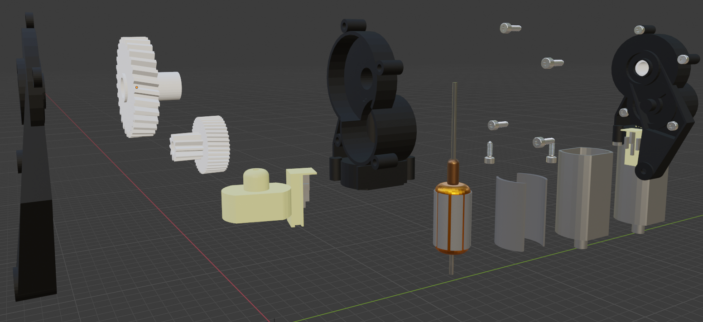

<span style="font-size: 0.85em;">
<b>Abstract:</b> To enable automatic disassembly of different product types with uncertain conditions and degrees of wear in remanufacturing, agile production systems that can adapt dynamically to changing requirements are needed. Machine learning algorithms can be employed due to their generalization capabilities of learning from various types and variants of products. However, in reality, datasets with a diversity of samples that can be used to train models are difficult to obtain in the initial period. This may cause bad performances when the system tries to adapt to new unseen input data in the future. In order to generate large datasets for different learning purposes, in our project, we present a Blender add-on named MotorFactory to generate customized mesh models of various motor instances. MotorFactory allows to create mesh models which, complemented with additional add-ons, can be further used to create synthetic RGB images, depth images, normal images, segmentation ground truth masks, and 3D point cloud datasets with point-wise semantic labels. The created synthetic datasets may be used for various tasks including motor type classification, object detection for decentralized material transfer tasks, part segmentation for disassembly and handling tasks, or even reinforcement learning-based robotics control or view-planning.
</span>

If you are interested in this work, please cite as below:

```text
@article{wu2022motorfactory,
  title={MotorFactory: a blender add-on for large dataset generation of small electric motors},
  author={Wu, Chengzhi and Zhou, Kanran and Kaiser, Jan-Philipp and Mitschke, Norbert and Klein, Jan-Felix and Pfrommer, Julius and Beyerer, J{\"u}rgen and Lanza, Gisela and Heizmann, Michael and Furmans, Kai},
  journal={Procedia CIRP},
  volume={106},
  pages={138--143},
  year={2022},
  publisher={Elsevier}
}
```
