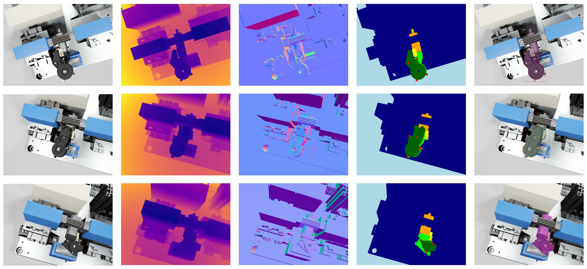

Abstract: In this paper, we develop a novel benchmark suite including both a 2D synthetic image dataset and a 3D synthetic point cloud dataset. Our work is a sub-task in the framework of a remanufacturing project, in which small electric motors are used as fundamental objects. Apart from the given detection, classification, and segmentation annotations, the key objects also have multiple learnable attributes with ground truth provided. This benchmark can be used for computer vision tasks including 2D/3D detection, classification, segmentation, and multi-attribute learning. It is worth mentioning that most attributes of the motors are quantified as continuously variable rather than binary, which makes our benchmark well-suited for the less explored regression tasks. In addition, appropriate evaluation metrics are adopted or developed for each task and promising baseline results are provided. We hope this benchmark can stimulate more research efforts on the sub-domain of object attribute learning and multi-task learning in the future.


If you are interested in this work, please cite as below:

```text
@inproceedings{wu2023synmotor,
  title={SynMotor: A Benchmark Suite for Object Attribute Regression and Multi-task Learning},
  author={Wu, Chengzhi and Qiu, Linxi and Zhou, Kanran and Pfrommer, Julius and Beyerer, J\"urgen},
  booktitle={Proceedings of the 18th International Joint Conference on Computer Vision, Imaging and Computer Graphics Theory and Applications (VISIGRAPP 2023)},
  volume={4},
  pages={529 – 540},
  year={2023}
}
```
