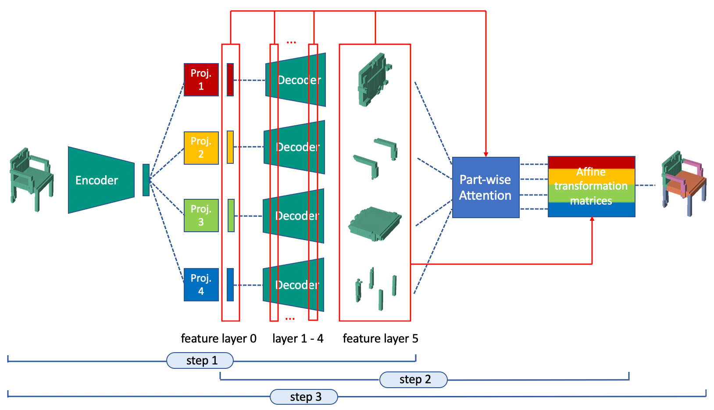

Abstract: Modeling a 3D volumetric shape as an assembly of decomposed shape parts is much more challenging, but semantically more valuable than direct reconstruction from a full shape representation. The neural network needs to implicitly learn part relations coherently, which is typically performed by dedicated network layers that can generate transformation matrices for each part. In this paper, we propose a VoxAttention network architecture for attention-based part assembly. We further propose a variant of using channel-wise part attention and show the advantages of this approach. Experimental results show that our method outperforms most state-of-the-art methods for the part relation-aware 3D shape modeling task.


If you are interested in this work, please cite as below:

```text
@inproceedings{wu2023attention,
  title={Attention-based Part Assembly for 3D Volumetric Shape Modeling},
  author={Wu, Chengzhi and Zheng, Junwei and Pfrommer, Julius and Beyerer, J{\"u}rgen},
  booktitle={Proceedings of the IEEE/CVF Conference on Computer Vision and Pattern Recognition},
  pages={2717--2726},
  year={2023}
}
```
