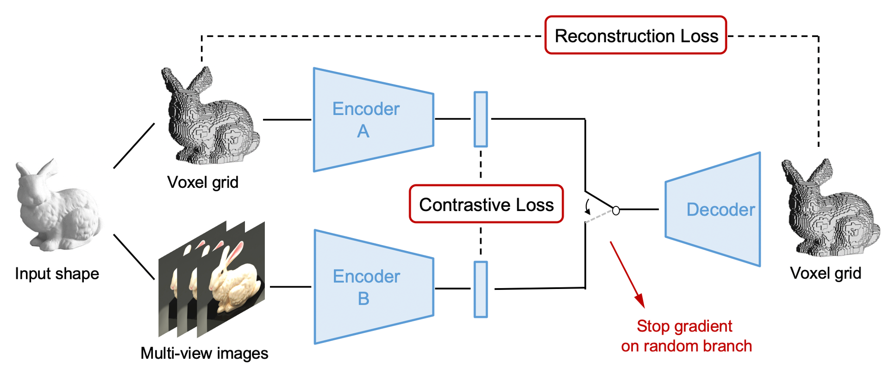

Abstract: We propose a combined generative and contrastive neural architecture for learning latent representations of 3D volumetric shapes. The architecture uses two encoder branches for voxel grids and multi-view images from the same underlying shape. The main idea is to combine a contrastive loss between the resulting latent representations with an additional reconstruction loss. That helps to avoid collapsing the latent representations as a trivial solution for minimizing the contrastive loss. A novel dynamic switching approach is used to cross-train two encoders with a shared decoder. The switching approach also enables the stop gradient operation on a random branch. Further classification experiments show that the latent representations learned with our self-supervised method integrate more useful information from the additional input data implicitly, thus leading to better reconstruction and classification performance.


If you are interested in this work, please cite as below:

```text
@article{wu2023self,
  title={Self-Supervised Generative-Contrastive Learning of Multi-Modal Euclidean Input for 3D Shape Latent Representations: A Dynamic Switching Approach},
  author={Wu, Chengzhi and Pfrommer, Julius and Zhou, Mingyuan and Beyerer, J{\"u}rgen},
  journal={IEEE Transactions on Multimedia},
  volume={26},
  pages={8432--8441},
  year={2023},
  publisher={IEEE}
}
```
