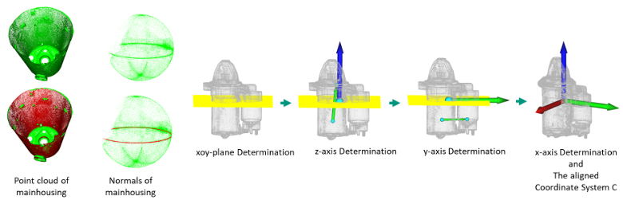

<span style="font-size: 0.85em;">
<b>Abstract:</b> The accurate estimation of 6D pose remains a challenging task within the computer vision domain, even when utilizing 3D point cloud data. Conversely, in the manufacturing domain, instances arise where leveraging prior knowledge can yield advancements in this endeavor. This study focuses on the disassembly of starter motors to augment the engineering of product life cycles. A pivotal objective in this context involves the identification and 6D pose estimation of bolts affixed to the motors, facilitating automated disassembly within the manufacturing workflow. Complicating matters, the presence of occlusions and the limitations of single-view data acquisition, notably when motors are placed in a clamping system, obscure certain portions and render some bolts imperceptible. Consequently, the development of a comprehensive pipeline capable of acquiring complete bolt information is imperative to avoid oversight in bolt detection. In this paper, employing the task of bolt detection within the scope of our project as a pertinent use case, we introduce a meticulously devised pipeline. This multi-stage pipeline effectively captures the 6D information with regard to all bolts on the motor, thereby showcasing the effective utilization of prior knowledge in handling this challenging task. The proposed methodology not only contributes to the field of 6D pose estimation but also underscores the viability of integrating domain-specific insights to tackle complex problems in manufacturing and automation.
</span>

If you are interested in this work, please cite as below:

```text
@article{wu20246d,
  title={6D Pose Estimation on Point Cloud Data through Prior Knowledge Integration: A Case Study in Autonomous Disassembly},
  author={Wu, Chengzhi and Fu, Hao and Kaiser, Jan-Philipp and Barczak, Erik Tabuchi and Pfrommer, Julius and Lanza, Gisela and Heizmann, Michael and Beyerer, J{\"u}rgen},
  journal={Procedia CIRP},
  volume={122},
  pages={193--198},
  year={2024},
  publisher={Elsevier}
}
```
