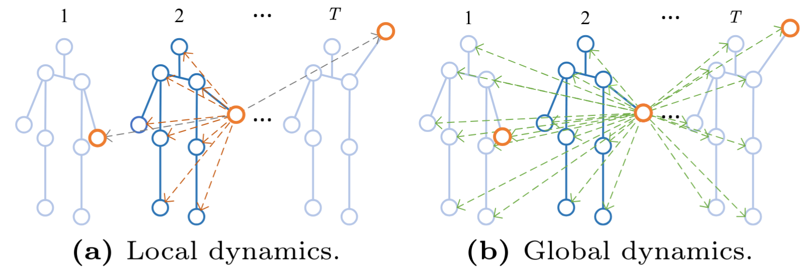

<span style="font-size: 0.85em;">
<b>Abstract:</b> Skeleton-based action recognition aims to identify human actions from joint coordinates and skeletal connections. Previous works have effectively employed graph convolutional networks and, more recently, attention-based architectures to capture joint topology. Yet, most approaches treat spatial and temporal dynamics separately. With the proven efficacy of global modeling in image and video recognition, it prompts an inquiry into its applicability and benefits for skeleton-based recognition. However, applying global modeling to skeletons introduces challenges, including extensive data requirements and substantial computational demands. In this paper, we attempt to address these challenges and present a detailed mathematical analysis of the computational complexities. We propose a novel, efficient model, HybridFormer, which initially uses local blocks for separate spatial and temporal modeling, laying a solid foundation for learning. Subsequently, global blocks with attention mechanisms merge these dimensions, capturing complex action interdependencies. This dual-phase approach overcomes previous limitations, achieves performance comparable to state-of-the-art on the NTU-60, NTU-120, and NW-UCLA datasets, and demonstrates significantly enhanced inference efficiency.
</span>

If you are interested in this work, please cite as below:

```text
@inproceedings{zhong2025hybridformer,
  title={HybridFormer: Bridging Local and Global Spatio-Temporal Dynamics for Efficient Skeleton-Based Action Recognition},
  author={Zhong, Zeyun and Li, Tianrui and Martin, Manuel and Cormier, Mickael and Wu, Chengzhi and Diederichs, Frederik and Beyerer, Juergen},
  booktitle={European Conference on Computer Vision},
  pages={19--35},
  year={2025},
  organization={Springer}
}
```
