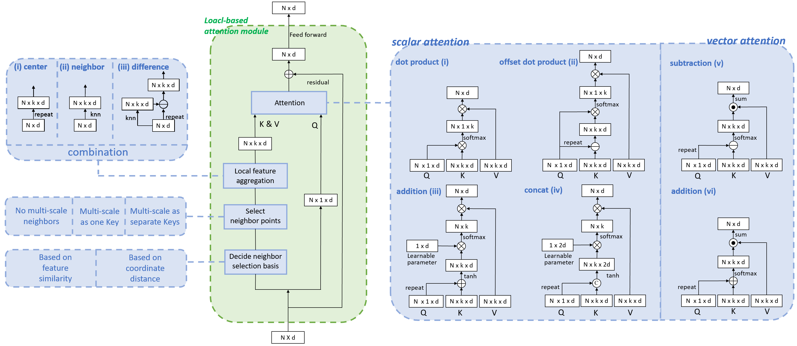

<span style="font-size: 0.85em;">
Abstract: In recent years, there have been significant advancements in applying attention mechanisms to point cloud analysis. However, attention module variants featured in various research papers often operate under diverse settings and tasks, incorporating potential training strategies. This heterogeneity poses challenges in establishing a fair comparison among these attention module variants. In this paper, we address this issue by rethinking and exploring attention module design within a consistent base framework and settings. Both global-based and local-based attention methods are studied, with a focus on the selection basis and scales of neighbors for local-based attention. Different combinations of aggregated local features and computation methods for attention scores are evaluated, ranging from the initial addition/concatenation-based approach to the widely adopted dot product-based method and the recently proposed vector attention technique. Various position encoding methods are also investigated. Our extensive experimental analysis reveals that there is no universally optimal design across diverse point cloud tasks. Instead, drawing from best practices, we propose tailored attention modules for specific tasks, leading to superior performance on point cloud classification and segmentation benchmarks.
</span>

If you are interested in this work, please cite as below:

```text
@inproceedings{wu2025rethinking,
  title={Rethinking Attention Module Design for Point Cloud Analysis},
  author={Wu, Chengzhi and Wang, Kaige and Zhong, Zeyun and Fu, Hao and Zheng, Junwei and Zhang, Jiaming and Pfrommer, Julius and Beyerer, J{\"u}rgen},
  booktitle={International Conference on Pattern Recognition (ICPR)},
  pages={249--267},
  year={2025},
  organization={Springer}
}
```
