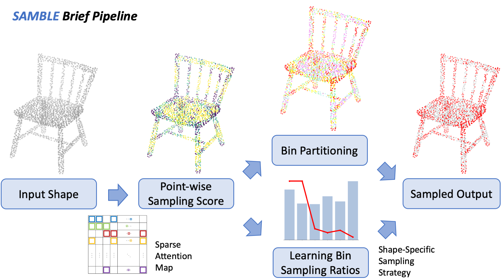

Abstract: Driven by the increasing demand for accurate and efficient representation of 3D data in various domains, point cloud sampling has emerged as a pivotal research topic in 3D computer vision. Recently, learning-to-sample methods have garnered growing interest from the community, particularly for their ability to be jointly trained with downstream tasks. However, previous learning-based sampling methods either lead to unrecognizable sampling patterns by generating a new point cloud or biased sampled results by focusing excessively on sharp edge details. Moreover, they all overlook the natural variations in point distribution across different shapes, applying a similar sampling strategy to all point clouds. In this paper, we propose a Sparse Attention Map and Bin-based Learning method (termed SAMBLE) to learn shape-specific sampling strategies for point cloud shapes. SAMBLE effectively achieves an improved balance between sampling edge points for local details and preserving uniformity in the global shape, resulting in superior performance across multiple common point cloud downstream tasks, even in scenarios with few-point sampling.


If you are interested in this work, please cite as below:

```text
@inproceedings{wu2025samble,
  author={Wu, Chengzhi and Wan, Yuxin and Fu, Hao and Pfrommer, Julius and Zhong, Zeyun and Zheng, Junwei and Zhang, Jiaming and Beyerer, J\"urgen},
  title={SAMBLE: Shape-Specific Point Cloud Sampling for an Optimal Trade-Off Between Local Detail and Global Uniformity},
  booktitle={Proceedings of the IEEE/CVF Conference on Computer Vision and Pattern Recognition (CVPR)},
  year={2025}
}
```
