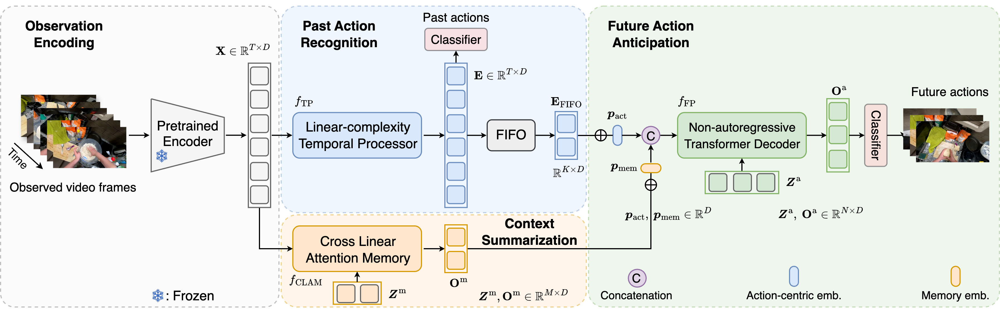

<span style="font-size: 0.85em;">
<b>Abstract:</b> Recent advances in action anticipation rely heavily on Transformer architectures to learn discriminative representations of the past observation, incurring high computational and memory overhead that limits their applicability to long videos. While temporal processors with linear complexity like RNNs and state-space models offer efficient alternatives, their sequential nature risks overlooking subtle cues in observed frames that could enhance future anticipation. We address this limitation with Cross Linear Attentive Memory (CLAM), a memory module that selectively retrieves complementary context cues from frame features. By reformulating linear attention to replace traditional cross attention, CLAM achieves linear computation complexity and constant memory usage relative to input length. Finally, by fusing the outputs of the temporal processor and CLAM, a non-autoregressive Transformer decoder generates future actions in one shot with high accuracy. Experiments on egocentric (EpicKitchens100 and Ego4D) and third-person (Thumos14) benchmarks demonstrate our model’s superior anticipation accuracy and scalability, processing longer sequences with significantly less latency growth than alternatives. Our approach also achieves promising results in online action detection.
</span>

If you are interested in this work, please cite as below:

```text
@inproceedings{zhong2026scalable,
  title={Scalable Video Action Anticipation with Cross Linear Attentive Memory},
  author={Zhong, Zeyun and Martin, Manuel and Schneider, David and Lerch, David J and Wu, Chengzhi and Diederichs, Frederik and Gall, Juergen and Beyerer, J{\"u}rgen},
  booktitle={Proceedings of the IEEE/CVF Winter Conference on Applications of Computer Vision},
  pages={8113--8123},
  year={2026}
}
```
