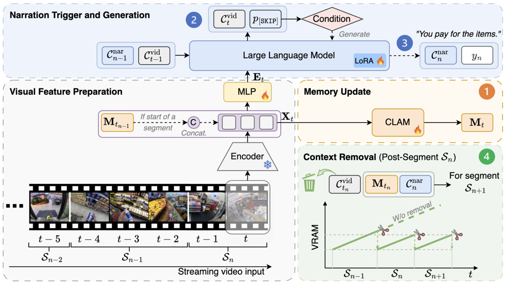

<span style="font-size: 0.85em;">
<b>Abstract:</b> Recent Large Multimodal Models (LMMs), primarily designed for offline settings, are ill-suited for the dynamic requirements of streaming video. While recent online adaptations improve real-time processing, they still face critical scalability challenges, with resource demands typically growing at least linearly with video duration. To overcome this bottleneck, we propose FlowNar, a novel framework for scalable streaming video narration. The core of FlowNar is a dynamic context management strategy for historical visual context removal, combined with our CLAM (Cross Linear Attentive Memory) module for streaming visual history retention, ensuring bounded visual memory usage and computational complexity, crucial for efficient streaming. We also introduce a realistic self-conditioned evaluation protocol and complementary evaluation metrics to assess streaming narration models under deployment-like conditions. Experiments on the Ego4D, EgoExo4D, and EpicKitchens100 datasets demonstrate that FlowNar substantially improves narration quality over strong baselines while being highly efficient, supporting processing of 10x longer videos and achieving 3x higher throughput (FPS). 
</span>

If you are interested in this work, please cite as below:

```text
@inproceedings{zhong2026flownar,
  title={FlowNar: Scalable Streaming Narration for Long-Form Videos},
  author={Zhong, Zeyun and Martin, Manuel and Wu, Chengzhi and Schneider, David and Diederichs, Frederik and Gall, Juergen and Beyerer, Juergen},
  booktitle={Proceedings of the International Conference on Machine Learning (ICML)},
  year={2026}
}
```
