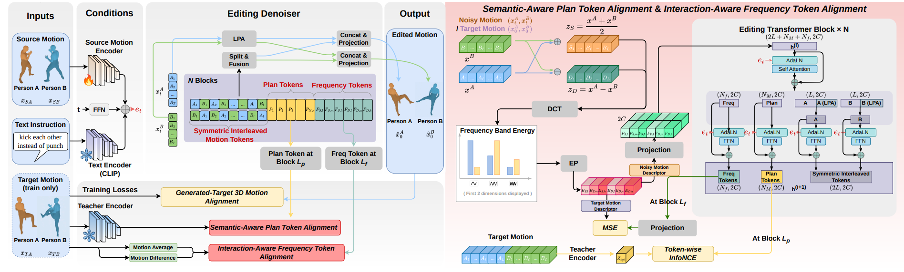

<span style="font-size: 0.85em;">
<b>Abstract:</b> Text-guided 3D motion editing has seen success in single-person scenarios, but its extension to multi-person settings is less ex-plored due to limited paired data and the complexity of inter-personinteractions. We introduce the task of multi-person 3D motion editing,where a target motion is generated from a source and a text instruction.To support this, we propose InterEdit3D, a new dataset with man-ual two-person motion change annotations, and a Text-guided Multi-human Motion Editing (TMME) benchmark. We present InterEdit,a synchronized classifier-free conditional diffusion model for TMME. Itintroduces Semantic-Aware Plan Token Alignment with learnable to-kens to capture high-level interaction cues and an Interaction-AwareFrequency Token Alignment strategy using DCT and energy poolingto model periodic motion dynamics. Experiments show that InterEditimproves text-to-motion consistency and edit fidelity, achieving state-of-the-art TMME performance. The dataset and code will be released athttps://github.com/YNG916/InterEdit.
</span>

If you are interested in this work, please cite as below:

```text
@inproceedings{yang2026interedit,
  author={Yebin Yang, Di Wen, Lei Qi, Weitong Kong, Junwei Zheng, Ruiping Liu, Yufan Chen, Chengzhi Wu, Kailun Yang, Yuqian Fu, Danda Pani Paudel, Luc Van Gool, Kunyu Peng},
  title={InterEdit: Navigating Text-Guided 3D Dyadic Human Motion Editing},
  booktitle={Proceedings of the European Conference on Computer Vision (ECCV)},
  year={2026}
}
```
