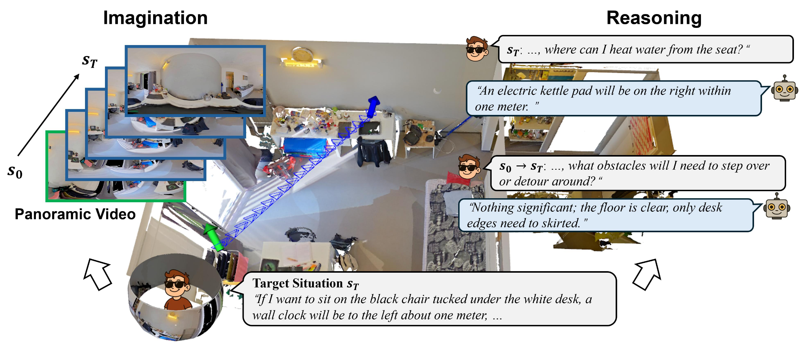

<span style="font-size: 0.85em;">
<b>Abstract:</b> Situated reasoning often relies on active exploration, yet in many real-world scenarios such exploration is infeasible due to physical constraints of robots or safety concerns of visually impaired users. Given only a limited observation, can an agent mentally simulate a future trajectory toward a target situation and answer spatial what-if questions? We introduce WanderDream, the first large-scale dataset designed for the emulative simulation of mental exploration, enabling models to reason without active exploration. WanderDream-Gen comprises 15.8K panoramic videos across 1,088 real scenes from HM3D, ScanNet++, and real-world captures, depicting imagined trajectories from current viewpoints to target situations. WanderDream-QA contains 158K question-answer pairs, covering starting states, paths, and end states along each trajectory to comprehensively evaluate exploration-based reasoning. Extensive experiments with world models and MLLMs demonstrate (1) that mental exploration is essential for situated reasoning, (2) that world models achieve compelling performance on WanderDream-Gen, (3) that imagination substantially facilitates reasoning on WanderDream-QA, and (4) that WanderDream data exhibit remarkable transferability to real-world scenarios.
</span>

If you are interested in this work, please cite as below:

```text
@inproceedings{liu2026wanderdream,
  title={What If? Emulative Simulation with World Models for Situated Reasoning},
  author={Liu, Ruiping and Chen, Yufan and Zhang, Yuheng and Zheng, Junwei and Peng, Kunyu and Wu, Chengzhi and Huang, Chenguang and Wen, Di and Zhang, Jiaming and Yang, Kailun and Stiefelhagen, Rainer},
  booktitle={European Conference on Computer Vision (ECCV)},
  year={2026}
}
```
